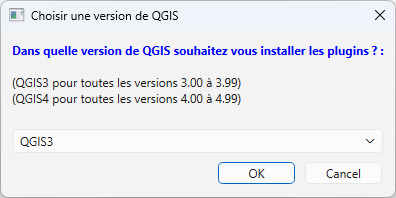
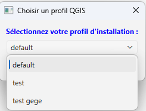
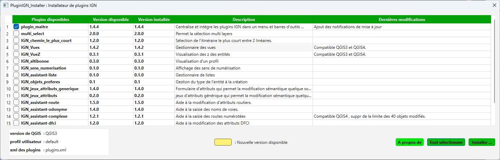

<table>
<colgroup>
<col style="width: 21%" />
<col style="width: 78%" />
</colgroup>
<tbody>
<tr>
<td rowspan="2"></td>
<td style="text-align: center;">
<strong>Manuel utilisateur de
« PluginIGN_Installer »</strong>

<strong>V0.6</strong>
</td>
</tr>
<tr>
<td style="text-align: center;"></td>
</tr>
</tbody>
</table>

**Sommaire**

[1 Résumé](#résumé)

[2 Lancement de l’application](#lancement-de-lapplication)

[3 Installation des plugins sélectionnés](#installation-des-plugins-sélectionnés)

# Résumé

Cette application sert à installer et à mettre à jour des plugins QGIS.

Les plugins à installer sont stockés dans un dépôt GitHub ou dans le
dépôt officiel QGIS

Cette application compare le dépôt GitHub ou dépôt officiel QGIS avec
les extensions installées sous QGIS.

# Lancement de l’application

Cette application est compatible QGIS 3 et 4, veuillez renseigner dans
quel version de QGIS vous voulez installer les plugins

Pour chaque version de QGIS, il est possible d’installer les plugins
dans des profils différents.

Après le choix du profil, on accède à :

Ici on retrouve tous les plugins disponibles pour installation.

- Version disponible : version du plugin correspondant dans le dépôt
  GitHub (ou dépôt officiel QGIS)

- Version installée : version du plugin correspondant installé dans
  QGIS.

# Installation des plugins sélectionnés

- Il faut choisir les plugins à installer puis clique sur « installer »

- Le plugin maitre étant obligatoire il est par défaut sélectionné, il
  ne peut pas être décoché.

Si le plugin maitre est déjà installé, il sera remplacé, seul le fichier
de configuration ne sera pas remplacé afin de sauvegarder la
configuration initiale.
